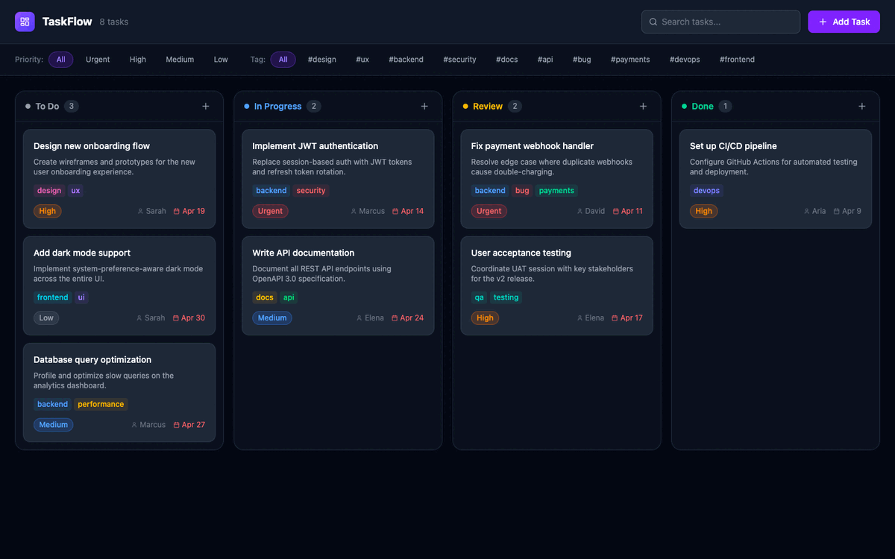

# React TaskFlow

A Kanban-style task management app built with React 19 and TypeScript 5.7. Manage tasks across workflow stages, filter by priority, create tasks with a sleek modal — powered by Tailwind CSS v4.

[](https://react.dev)
[](https://www.typescriptlang.org)
[](https://tailwindcss.com)
[](https://vitejs.dev)

## Preview



## Features

- **Kanban Board** — To Do → In Progress → Review → Done
- **Priority System** — Urgent, High, Medium, Low badges with color coding
- **Tags** — Colorful tag pills per card, with autocomplete input
- **Task Modal** — Full form with title, description, priority, status, assignee, due date, and tags
- **Search** — Instant full-text search across titles and tags
- **Priority Filter** — Filter all columns simultaneously by priority level

## Tech Stack

| Technology | Version | Purpose |
|---|---|---|
| React | 19 | UI framework |
| TypeScript | 5.7 | Type safety |
| Tailwind CSS | v4 | Vite plugin — zero config |
| Lucide React | 0.344 | Icons |
| Vite | 6.2 | Build tool |

## Quick Start

```bash
git clone https://github.com/mariotavarez/react-taskflow.git
cd react-taskflow
npm install
npm run dev
```

## Structure — Atomic Design

```
src/
├── atoms/
│   ├── Button.tsx          # Primary / ghost / danger / outline variants
│   ├── Input.tsx           # Text input with label and error state
│   ├── PriorityBadge.tsx   # Color-coded priority pill
│   ├── Select.tsx          # Dropdown with label
│   ├── TagPill.tsx         # Tag with optional remove button
│   └── Textarea.tsx        # Multi-line input with label
├── molecules/
│   ├── FilterChip.tsx      # Active/inactive filter button with count
│   ├── FormField.tsx       # Tag input with pill management
│   └── TaskCard.tsx        # Full task card (PriorityBadge + TagPills)
├── organisms/
│   ├── BoardHeader.tsx     # Title bar with Add Task button
│   ├── FilterBar.tsx       # Search input + priority FilterChips
│   ├── KanbanColumn.tsx    # Labeled column with TaskCard list
│   └── TaskModal.tsx       # Full create/view task form modal
├── templates/
│   └── BoardLayout.tsx     # BoardHeader + main content area
├── pages/
│   └── BoardPage.tsx       # Full page — state, filtering, modal logic
├── store/taskStore.ts      # useState-based task store with CRUD
├── types/index.ts
├── App.tsx
└── main.tsx
```

## Tailwind CSS v4

No config file needed:

```ts
// vite.config.ts
import tailwindcss from '@tailwindcss/vite'
export default defineConfig({ plugins: [react(), tailwindcss()] })
```

```css
/* src/index.css */
@import "tailwindcss";
```

## License

MIT © Mario Tavarez
